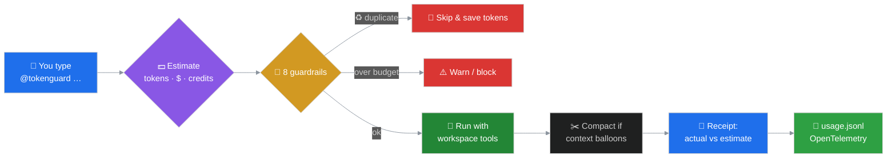

<div align="center">

# 🛡️ TokenGuard

### *Your live token-economics coach — right inside VS Code chat*


<br/>

> ### 💥 *Cheaper tokens. Exploding bills.*
> TokenGuard watches every AI request **before it runs**, tells you what it will cost in **tokens · dollars · credits**, flags the mistakes that quietly drain your budget, and **refuses to let you pay twice for the same answer.**

</div>

---

<div align="center">

## ⚡ The 30-second pitch

</div>

You type **`@tokenguard`** in chat. It does five things, every single turn:

<div align="center">

| 1️⃣ | 2️⃣ | 3️⃣ | 4️⃣ | 5️⃣ |
|:--:|:--:|:--:|:--:|:--:|
| 💵 **Estimate** | ⚠️ **Flag** | 🔧 **Run** | 🧾 **Reconcile** | 📡 **Log** |
| cost before it runs | mistakes live | with real tools | estimate vs actual | as OpenTelemetry |

</div>

…all while enforcing a **session + daily token budget** you control. 🎯

---

## 🔄 How a turn flows



---

## 🎯 Why it exists

<table>
<tr>
<td width="50%" valign="top">

### 📉 The paradox
Per-token prices **collapsed** — yet enterprise AI bills keep **climbing**. Agentic workloads re-read their entire growing context on every step: the **context snowball** ❄️.

</td>
<td width="50%" valign="top">

### 💡 The shift
The cost of an AI feature is now decided by **how you use it**, not in procurement. TokenGuard makes that hidden cost **visible & controllable — live, in the editor.**

</td>
</tr>
</table>

---

## 🚦 The eight live guardrails

> *Every request is scored against the token-economics playbook before a single token is spent.*

| | Rule | 🎯 Catches |
|:--:|:--|:--|
| ♻️ | **Duplicate request** | Asking the same thing twice → **skips it, saves the tokens** |
| 📁 | **Whole-workspace attached** | Re-reading everything, every turn |
| ❄️ | **Context snowball** | History ballooning turn-over-turn |
| 🔐 | **Sensitive data** | Matches your configured sensitive-data patterns |
| 🧊 | **Cache-unfriendly order** | Variable content *before* stable instructions |
| 💸 | **Overkill model** | Frontier model on a routine task → **names a cheaper one + $ saved** |
| 📏 | **No output cap** | Verbose generation with no brevity instruction |
| 🧠 | **Reasoning surcharge** | Hidden thinking tokens that would otherwise undercount |

---

## ✨ Feature highlights

<table>
<tr>
<td width="33%" valign="top" align="center">

### 💰
**Budget control**
Session + daily ceilings, persisted. Status-bar meter goes 🟢 → 🟡 → 🔴. Optional hard block.

</td>
<td width="33%" valign="top" align="center">

### 💵
**Three currencies**
Every turn in **tokens**, **dollars** (in/out split), *and* **Copilot credits**.

</td>
<td width="33%" valign="top" align="center">

### 🔧
**Real tools**
Read-only `list · read · grep · find` so it answers from your **actual folder**.

</td>
</tr>
<tr>
<td width="33%" valign="top" align="center">

### ✂️
**Real compaction**
Summarises old tool results in place — *defuses* the snowball, not just warns.

</td>
<td width="33%" valign="top" align="center">

### 🎯
**Tiered tools**
Sends only the tools **relevant** to your prompt — not every schema, every call.

</td>
<td width="33%" valign="top" align="center">

### 📡
**OTel export**
Rich per-turn record to `.tokenguard/usage.jsonl` in **GenAI semantic conventions**.

</td>
</tr>
</table>

---

## 🧾 What a turn looks like

```text
🛡️ TokenGuard · turn 3 · session tg-m4x2p-a7f9c1
This request: ~8,028 input + ~2,000 output ≈ $0.020 on gemini-3-flash · ≈ 1 credit/request
Session: 36% of budget · $0.011 · Today: 27% · $1.79
💸 Cheaper model likely enough — try gemini-1.5-flash: ~$0.002 vs $0.490, saves 100%
─────────────────────────────────────────────────────────
…the actual answer, using your workspace…
─────────────────────────────────────────────────────────
🧾 This turn actually cost: 11,641 input + 370 output = $0.016 · ≈ 1 credit (−18% vs est.)
```

---

## 📊 …and what it quietly writes to disk

```jsonc
{
  "gen_ai.request.model": "claude-opus-4.8",
  "gen_ai.usage.input_tokens": 11370,
  "gen_ai.usage.output_tokens": 1373,
  "gen_ai.server.time_to_first_token_ms": 4460,
  "gen_ai.client.operation.duration_ms": 22240,
  "tokenguard.cost_usd": 0.27,
  "tokenguard.input_cost_usd": 0.17,
  "tokenguard.output_cost_usd": 0.10,
  "tokenguard.tool_calls_count": 3,
  "tokenguard.tool_names": ["tg_find_files", "tg_list_dir", "tg_grep"],
  "tokenguard.loop_iterations": 3,
  "tokenguard.tokens_saved_by_tiering": 31812,
  "tokenguard.suggested_cheaper_model": "gemini-1.5-flash",
  "tokenguard.session_id": "tg-m4x2p-a7f9c1",
  "tokenguard.turn_index": 3
}
```

> 🎁 The five metrics the research keeps demanding — **tokens/task · cost/task · latency · retries · savings** — all in one line, ready for your Observability Hub.

---

## 🚀 Quick start

```powershell
# 1 · build
cd tokenguard
npm install
npm run compile

# 2 · install for every session
npx @vscode/vsce package --allow-missing-repository
code --install-extension tokenguard-0.1.0.vsix --force
```

Then, in chat:

```
@tokenguard check if today's report emails were sent
```

> 💡 Prefer a sandbox? Press **F5** to launch an Extension Development Host instead.

---

## 🎛️ Commands & ⚙️ settings

<table>
<tr>
<td width="50%" valign="top">

**Commands**

| Command | Does |
|---|---|
| 🎯 Set Token Budgets | session + daily limits |
| ♻️ Reset Session Budget | zero session + turns |
| 📊 Show Usage Report | quick summary |

</td>
<td width="50%" valign="top">

**Top settings** (`tokenguard.*`)

| Setting | Default |
|---|---|
| `sessionBudget` / `dailyBudget` | 50k / 500k |
| `hardBlock` | false |
| `blockDuplicates` | true |
| `enableCompaction` | true |
| `maxToolsPerRequest` | 64 |
| `reasoningOutputMultiplier` | 2.5 |

</td>
</tr>
</table>

---

## 🧭 TokenGuard vs. the Agent Framework harness

<div align="center">

> ### 🏎️ *The harness is the **engine** with cost controls built in.*
> ### ⛽ *TokenGuard is the **live fuel gauge + driving coach** bolted onto your chat.*

</div>

It ports the harness's cost-and-context core — **loop control · compaction · tiered tools · OTel** — into VS Code chat, and adds what the harness lacks: **live, human-facing cost coaching.** It deliberately skips the production-runtime pieces (background agents, shell execution, approval policy).

---

## ⚠️ Honest limits

- 🔒 Only guides messages sent to **`@tokenguard`** — plain Copilot turns are invisible (their counts are internal to Copilot).
- 📐 Dollar & credit figures are **estimates** from published prices / editable multipliers — not Copilot's exact bill.
- 🧰 Its file tools are **read-only** and simpler than Copilot's native harness — great for inspection, not a full agent runtime.

---

<div align="center">

### *Built to make every token a decision — not a surprise.* 🛡️

</div>
