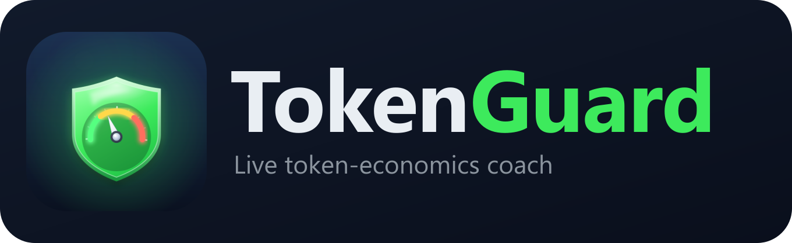

<p align="center">
  
</p>

# TokenGuard — Live Token Economics Coach for VS Code

TokenGuard lives inside VS Code chat as a participant (`@tokenguard`) and as an
always-on status-bar budget meter. It estimates tokens **before** the model runs,
enforces a session **and** daily token budget, and highlights token-economics
mistakes as you chat — turning the principles from the token-economics research
into live guardrails.

## What it does

**Budget control (session + daily)**
- Counts real input + output tokens using the selected model's own tokenizer.
- Tracks a per-session counter and a persisted per-day counter (survives reloads).
- Status bar shows `🛡️ 3.2k/50k · day 40k/500k`; turns amber at your warn threshold
  and red when over budget.
- Optional **hard block**: refuse requests that would bust the budget.

**Six live mistake detectors** (shown as a coaching panel above every answer)
1. 📁 **Whole workspace / too many files attached** — re-read every turn.
2. ❄️ **Context snowball** — context grew sharply since the last turn.
3. 🔐 **Sensitive data in prompt** — matches your configured sensitive-data patterns.
4. 🧊 **Cache-unfriendly ordering** — variable content before stable instructions.
5. 💸 **Overkill model** — frontier model on a routine format/refactor/boilerplate task.
6. 📏 **No output cap** — generative ask with no brevity instruction (output is ~4–6× input).

**Historical analytics (ground-truth, from Copilot's own logs)**
- 📊 **Real Historical Usage** — reads the real `promptTokens`/`outputTokens` Copilot
  persists in `chatSessions/*.jsonl`, aggregated per model across this workspace or
  all workspaces. Not an estimate.
- 🎯 **Personal Calibration** — learns per-model baselines (output/input ratio, avg
  cost) from those real tokens and auto-corrects the live reasoning multiplier and
  snowball threshold.
- 🧾 **Edit ROI** — joins `chatEditingSessions` checkpoints with git to score each
  AI-edited file as ✅ kept / 🔁 rework / 🗑️ discarded / 🕗 pending, attributes edits
  to the model that made them (via `requestId`), and estimates cost per model.

## How to run it

```powershell
cd tokenguard
npm install
npm run compile
```

Then press **F5** in VS Code (or Run → *Run TokenGuard Extension*). A second VS Code
window opens with the extension loaded.

In that window, open the Chat view and start a message with **`@tokenguard`**, e.g.:

```
@tokenguard refactor this function to be async
```

TokenGuard shows its coaching panel and budget, then forwards the request to the
selected model and streams the answer.

## Commands

- **TokenGuard: Set Token Budgets** — set session and daily limits.
- **TokenGuard: Reset Session Budget** — zero the session counter.
- **TokenGuard: Show Usage Report** — quick summary (also on status-bar click).
- **TokenGuard: Show Usage Dashboard** — rich HTML dashboard: summary cards, a
  stacked cost-over-time chart, and per-model & per-project attribution — all from
  real Copilot token counts.
- **TokenGuard: Show Personal Calibration** — real per-model baselines feeding the
  live rules.
- **TokenGuard: Show Edit ROI (did the edits stick?)** — kept/rework/discarded
  verdicts per file and per model.

## Settings (`tokenguard.*`)

| Setting | Default | Purpose |
|---|---|---|
| `sessionBudget` | 50000 | Tokens per session before block/warn |
| `dailyBudget` | 500000 | Tokens per day |
| `warnThresholdPercent` | 80 | When to start warning |
| `hardBlock` | false | Refuse over-budget requests |
| `maxAttachedReferences` | 5 | Attachment count that triggers a warning |
| `snowballGrowthTokens` | 4000 | Per-turn growth that triggers the snowball warning |
| `cheapModelHints` | mini, haiku, flash… | Identify small models (skip overkill rule) |
| `sensitivePatterns` | (empty) | Your own regexes that flag sensitive data |
| `modelPrices` | built-in table | Per-model USD/1M input & output rates (override/add) |
| `reasoningOutputMultiplier` | 2.5 | Default output inflation for reasoning models (auto-calibrated from real data when available) |
| `assumedCacheReadFraction` | 0 | **Opt-in** fraction of input assumed cached; 0 = list-price upper bound |
| `cacheReadPriceMultiplier` | 0.1 | Cached input price as a fraction of the input rate |

## Known limits

- A chat participant only sees requests routed to **`@tokenguard`** for the **live**
  coaching panel. Plain Copilot Chat turns aren't intercepted live — but the
  **historical analytics** read Copilot's persisted logs, so Real Usage, Calibration,
  and Edit ROI cover **all** your chats, not just `@tokenguard` ones.
- Token counts in the analytics are **ground truth** (Copilot's own
  `promptTokens`/`outputTokens`). **Cost is a list-price upper bound**: Copilot does
  not record the prompt-cache split, so cached input is billed at full rate unless
  you opt in via `assumedCacheReadFraction`.
- Live pre-flight token counts for attached context are best-effort (some reference
  kinds fall back to a chars/4 heuristic).
